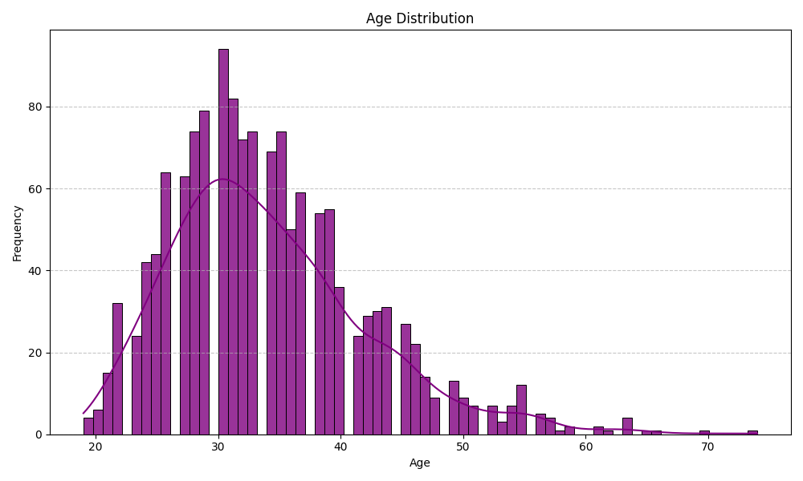
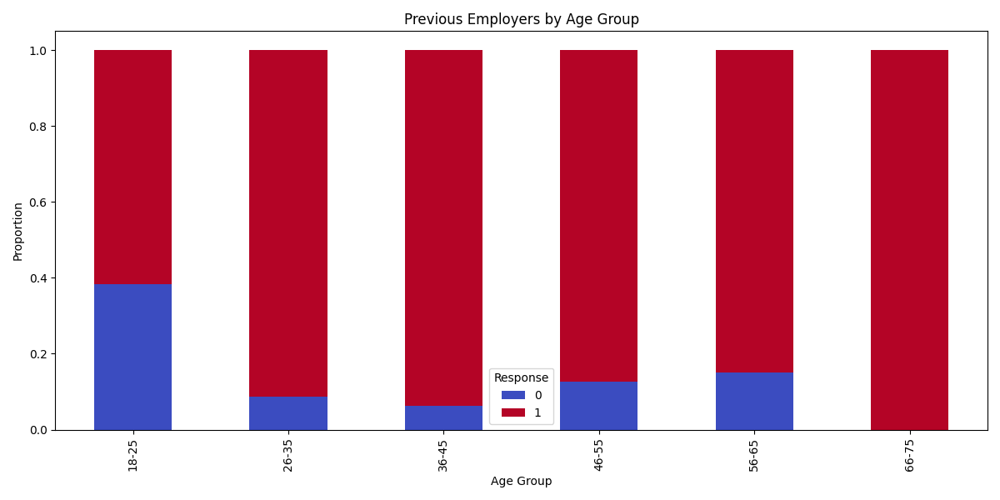
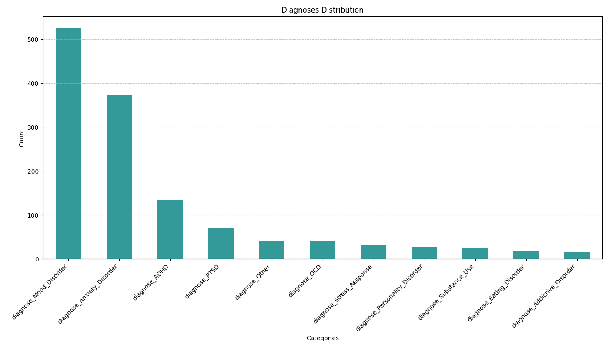
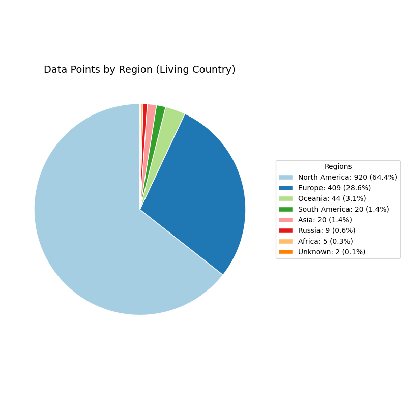
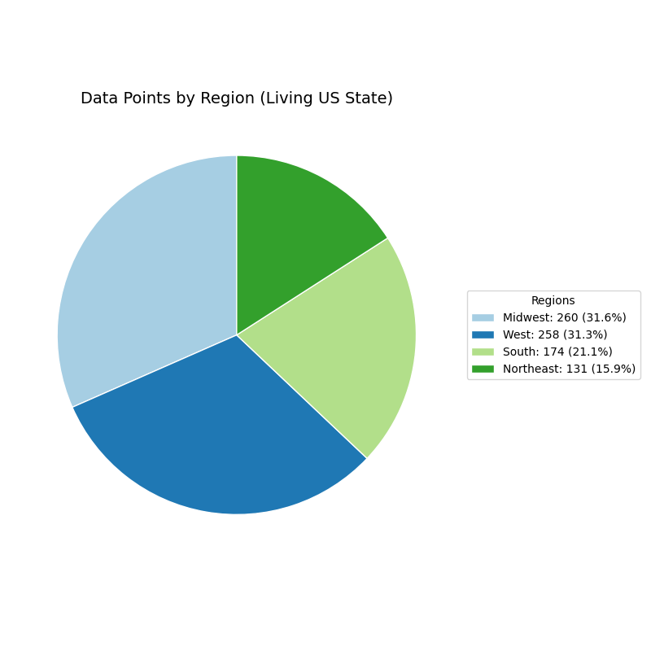
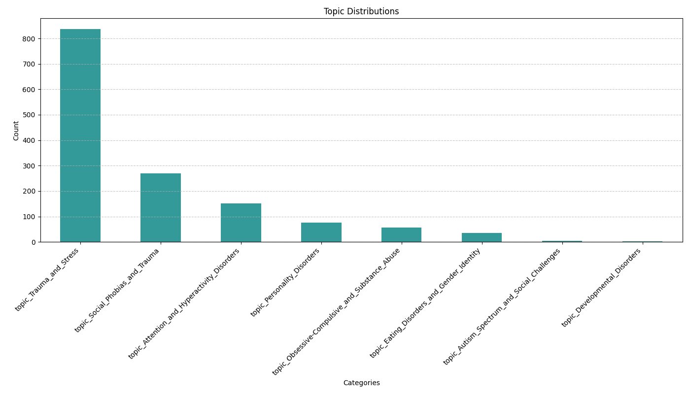

# Results of Mental Health Clustering Analysis

## Overview
The clustering analysis was conducted to segment survey participants into distinct groups based on their responses. The goal was to uncover meaningful patterns and characteristics that can inform HR strategies for addressing mental health concerns in the workplace. The dataset underwent preprocessing, cleaning, and feature engineering before applying clustering techniques.

## Summary of Findings
- **15 Clusters Identified:** Each cluster represents a different group of employees with similar responses regarding mental health topics, workplace roles, and personal experiences.
- **Key Influencing Features:** Topics such as *Trauma and Stress*, *Social Phobias*, *Personality Disorders*, *Hiring Concerns*, and *Fear of Discrimination* were dominant across various clusters.
- **Role Distribution:** Most clusters contained a majority of *backend developers* and *frontend developers*, with other roles like *designers, executives, and HR* appearing in smaller proportions.
- **Geographical Distribution:** The majority of survey participants resided and worked in *North America (64%)*, followed by *Europe (28%)*, with smaller proportions from other regions.
- **Age Distribution:** Most participants fell within the *26-35* and *36-45* age groups, with a median age of approximately 33 years.

---

## Cluster Analysis
### **Cluster 0**  
- **Strongest Parameter:** *Fear of Discrimination or Negative Impact*  
- **Second Strongest Parameter:** *Trauma and Stress*  
- **Interpretation:** Employees in this cluster likely experience anxiety regarding disclosing mental health conditions at work. They may need confidential counseling and assurance of workplace policies protecting them from discrimination.

### **Cluster 1**  
- **Strongest Parameter:** *Trauma and Stress*  
- **Second Strongest Parameter:** *Reasons for Disclosure or Non-Disclosure*  
- **Interpretation:** This cluster consists of employees who struggle with work-related stress and trauma but are also contemplating whether to disclose their mental health conditions.

### **Cluster 2**  
- **Strongest Parameter:** *Hiring Concerns*  
- **Second Strongest Parameter:** *Trauma and Stress*  
- **Interpretation:** These employees are primarily concerned about how their mental health history impacts their job opportunities.

### **Cluster 3**  
- **Strongest Parameter:** *Social Phobias and Trauma*  
- **Second Strongest Parameter:** *Chances and Bias*  
- **Interpretation:** Employees in this cluster are concerned about workplace bias and discrimination stemming from social anxiety or past trauma.

### **Cluster 4**  
- **Strongest Parameter:** *Personality Disorders*  
- **Second Strongest Parameter:** *Is your employer primarily a tech company/organization?*  
- **Interpretation:** This cluster represents individuals who identify with personality disorders. These employees might benefit from tailored support systems addressing specific mental health challenges.
### **Cluster 5**  
- **Strongest Parameter:** *Social Phobias and Trauma*  
- **Second Strongest Parameter:** *Have you ever sought treatment for a mental health issue from a mental health professional?*  
- **Interpretation:** This cluster comprises individuals who experience significant social anxiety and trauma, which may affect their workplace interactions and productivity. Supportive measures could include initiatives fostering inclusivity and mental health accessibility.

### **Cluster 6**  
- **Strongest Parameter:** *Trauma and Stress*  
- **Second Strongest Parameter:** *Chances and Bias*  
- Employees facing workplace-related stress along with concerns about unfair treatment or bias.

### **Cluster 7**  
- **Strongest Parameter:** *Autism Spectrum and Social Challenges*  
- **Second Strongest Parameter:** *Is your employer primarily a tech company/organization?*  
- Individuals in this cluster might struggle with social interactions in the workplace, requiring better accommodations.

### **Cluster 8**  
- **Strongest Parameter:** *Trauma and Stress*  
- **Second Strongest Parameter:** *Relevance to Job or Business*  
- Employees experiencing mental health struggles that they believe directly impact their work performance.

### **Cluster 9**  
- **Strongest Parameter:** *Personal Feelings and Uncertainty*  
- **Second Strongest Parameter:** *Trauma and Stress*  
- This cluster consists of employees dealing with self-doubt and workplace-related stressors.

### **Cluster 10**  
- **Strongest Parameter:** *Backend Developer Role*  
- **Second Strongest Parameter:** *Developmental Disorders*  
- This group consists primarily of backend developers who identify with developmental disorders, possibly requiring flexible work conditions.

### **Cluster 11**  
- **Strongest Parameter:** *Obsessive-Compulsive and Substance Abuse*  
- **Second Strongest Parameter:** *Have you ever sought treatment for a mental health issue from a mental health professional?*  
- This cluster includes employees who may require additional resources related to OCD and substance use concerns.

### **Cluster 12**  
- **Strongest Parameter:** *Eating Disorders and Gender Identity*  
- **Second Strongest Parameter:** *Have you ever sought treatment for a mental health issue from a mental health professional?*  
- Employees who struggle with gender identity issues and eating disorders, possibly requiring targeted workplace initiatives.

### **Cluster 13**  
- **Strongest Parameter:** *Sales Role*  
- **Second Strongest Parameter:** *Have you ever sought treatment for a mental health issue from a mental health professional?*  
- This cluster predominantly consists of employees in sales who face unique workplace stressors.

### **Cluster 14**  
- **Strongest Parameter:** *Attention and Hyperactivity Disorders*  
- **Second Strongest Parameter:** *Have you ever sought treatment for a mental health issue from a mental health professional?*  
- Employees struggling with ADHD-related symptoms that may affect productivity and require workplace accommodations.

### **Important Notes**
- The presence of "Is your employer primarily a tech company/organization?" as a significant parameter in Cluster 4 and Cluster 7 highlights their direct relevance to tech organizations. These clusters should be prioritized in HR's initiatives, as they represent groups with unique challenges specific to a tech setting.
- Clusters 11, 12, 13, and 14 consistently include "Have you ever sought treatment for a mental health issue from a mental health professional?" as a secondary parameter. This suggests that individuals in these clusters have previously sought help but may still be facing persistent challenges, emphasizing the need for ongoing and tailored workplace support.

---

## Age Distribution
Most respondents were between **26-35 years old**, followed by the **36-45** age range, with a median age of **33 years**. There were few participants above **55 years**, suggesting that mental health concerns might be more prominent among younger professionals. 

There is a clear correlation between Column 24: Do you have previous employers? and age. Younger participants are more likely to have limited prior work experience, while older professionals are more likely to have had multiple employers, reflecting natural career progression trends.

---

## Diagnoses Distribution
- The most commonly reported conditions were **Mood Disorders**, **Anxiety Disorders**, and **ADHD**.
- Less frequent diagnoses included **Personality Disorders, Substance Use Disorders, and Developmental Disorders**.

---

## Regional Distribution
- The majority of survey participants resided in **North America (64%)**, followed by **Europe (28%)**.
- Other regions, including **Oceania, Asia, South America, and Africa**, had lower representation.

- Within the United States, the distribution of participants was fairly even across states, with some clustering in states like California, Texas, and New York, reflecting major tech hubs.

- A notable observation is that the distribution of working and living regions is almost identical, indicating that most respondents work in the same geographical location as their residence, which is particularly relevant for analyzing regional mental health trends.

---

## Mental Health Diagnoses
- Mood Disorders and Anxiety Disorders are the most prevalent.
- ADHD (Attention Deficit Hyperactivity Disorder), PTSD (Posttraumatic Stress Disorder), and OCD (Obsessive-Compulsive Disorder) also show significant representation.
   - 50: Have you been diagnosed with a mental health condition by a medical professional?
   - 51: If so, what condition(s) were you diagnosed with?
- The distribution of mental health diagnoses aligns with the topic distribution extracted from the survey responses (48, 49).
   - 47: Do you currently have a mental health disorder?
   - 48: If yes, what condition(s) have you been diagnosed with?
   - 49: If maybe, what condition(s) do you believe you have?

## Topic Distributions 48,49
- The most common topics in survey responses include:
   - Trauma and Stress
   - Social Phobias and Trauma
   - Attention and Hyperactivity Disorders
   - Obsessive-Compulsive and Substance Abuse

---

## Investigation of Column 24: Previous Employers

- Prevalence: 92.5% of respondents had previous employers.
- Chi-Square Test with Clusters: No significant association (p-value = 0.72).
- Correlation with Age: Higher likelihood of previous employers among older respondents.
- Mental Health Diagnosis Relation: Slightly higher association with mood disorders and trauma-related conditions.

---

## Correlation Analysis

- The correlation analysis identifies relationships between diagnoses, mental health topics, roles, and clusters.

- To generate these results, run:
   - python Correlation.py

- For further investigation, modify and execute:
   - **Replace "diagnose_Mood_Disorder" with another column to explore different relationships.**
   - diagnose_correlations = correlation_matrix["diagnose_Mood_Disorder"].sort_values(ascending=False)
   - print(diagnose_correlations[diagnose_correlations.abs() > 0.2])

## **Key Findings**
- **General Trends**  
  - Strong correlations exist between **ADHD diagnoses** and **Attention and Hyperactivity Disorders** topics.
  - **Anxiety and Mood Disorders** show high correlation, suggesting overlapping mental health challenges.
  - Specific **roles (e.g., backend developer, sales, one-person shop)** show associations with mental health concerns.
  - Clusters are significantly correlated with **topics related to stress, trauma, and hiring concerns**.

- **Cluster-Specific Insights**  
  - **Cluster 0 & 1**: High correlation with **fear of discrimination** and **reasons for disclosure**.
  - **Cluster 5 & 6**: Strong links to **social phobias and trauma-related stress**.
  - **Cluster 10**: The **backend developer role** is notably correlated with **developmental disorders**.
  - **Cluster 12**: **Gender identity** and **eating disorders** are key differentiators.

- **Further Investigations**  
  - More detailed analysis can be conducted by modifying `Correlation.py` to explore:
    - The impact of **mental health diagnoses on job roles**.
    - The relationship between **work environment and mental health concerns**.
    - **Cluster-specific correlations** for targeted HR initiatives.
---

## Key Takeaways
- **Fear of Disclosure & Workplace Bias:** Several clusters indicated fear of discrimination, affecting their willingness to disclose mental health conditions.
- **Trauma & Stress Prevalence:** The majority of clusters had stress-related conditions as a dominant feature, suggesting a need for stress management programs.
- **Workplace Accommodations:** Some roles, such as **backend developers and sales professionals**, showed unique stressors, possibly requiring role-specific workplace accommodations.
- **Younger Employees More Affected:** The high prevalence of mental health concerns in the **26-35 age group** indicates that early-career professionals may require additional support.

---

## Next Possible Steps
- **Policy Implementation:** HR should consider policies that ensure a stigma-free workplace and promote open discussions about mental health.
- **Targeted Programs:** Implement targeted initiatives for employees struggling with **anxiety, stress, and workplace bias**.
- **Further Research:** Additional clustering with **different features** may provide deeper insights into workplace mental health dynamics.

